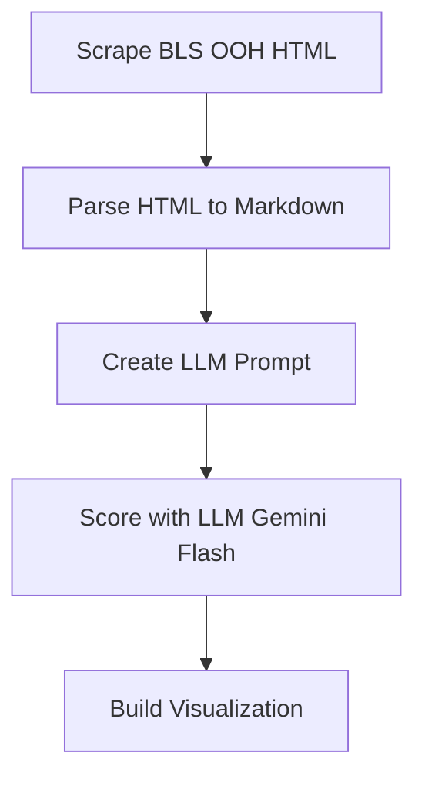
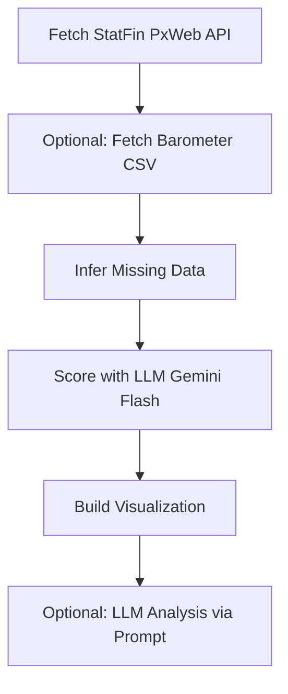

# Finland Job Market Visualizer

Explore Finnish occupation data (StatFin PxWeb + Occupational Barometer) and color it by AI exposure.

## LLM-powered coloring

The repo still lets you score occupations with an LLM (Google AI Studio / Gemini). You can change the rubric in `score.py` to rate anything (AI exposure, offshoring risk, climate impact) and recolor the treemap. Scores are cached in `scores.json`.

**What "AI Exposure" is NOT:**

- It does **not** predict that a job will disappear. Software developers score 9/10 because AI is transforming their work — but demand for software could easily _grow_ as each developer becomes more productive.
- It does **not** account for demand elasticity, latent demand, regulatory barriers, or social preferences for human workers.
- The scores are rough LLM estimates (Gemini Flash via Google AI Studio), not rigorous predictions. Many high-exposure jobs will be reshaped, not replaced.

## Data pipeline (Finland)

1. **Fetch StatFin** (`fetch_statfin.py`) — Queries Statistics Finland PxWeb tables (config-driven) to produce `occupations.json` and `occupations.csv` with pay (EUR), employment counts, and optional outlook labels.
2. **Import Barometer outlook (optional)** (`fetch_barometer.py`) — Normalizes Labour Force Barometer CSV into extras-compatible outlook columns (`code`, `outlook_pct`, `outlook_desc`).
3. **Infer missing pay** (`infer_missing_pay.py`) — Uses statistical inference to estimate missing pay data based on occupation characteristics.
4. **Score AI exposure** (`score.py`) — LLM scoring (0-10) using Gemini Flash via Google AI Studio. Requires `GOOGLE_API_KEY` in `.env` (get from https://aistudio.google.com/apikey).
5. **Build site data** (`build_site_data.py`) — Merges `occupations.csv` and `scores.json` into `site/data.json` for the treemap.
6. **Generate prompt (optional)** (`make_prompt.py`) — Creates a comprehensive data document for LLM analysis.

## Process Map

### Original US Method (karpathy/jobs)


### Finland Adapted Method


**Key Differences:**
- **Data Source**: StatFin API vs. BLS OOH scraping
- **AI Scoring**: LLM (Gemini Flash) scoring for both, but Finnish occupation context
- **Outlook Data**: Occupational Barometer vs. BLS projections
- **Currency**: EUR vs. USD
- **Education System**: Finnish vs. US education levels

## Key files

| File                                        | Description                                                                  |
| ------------------------------------------- | ---------------------------------------------------------------------------- |
| `data/statfin_config.example.json`          | Template for PxWeb tables/variables (employment, wages, outlook)             |
| `src/fetch_statfin.py`                      | PxWeb fetcher that writes `data/occupations.json` and `data/occupations.csv` |
| `src/fetch_barometer.py`                    | Converts Barometer CSV to extras-compatible outlook CSV                      |
| `src/score.py`                              | LLM scoring of AI exposure using Gemini Flash via Google AI Studio           |
| `src/generate_complete_outlook.py`          | One-time tool: fills missing outlook/education in `extras.csv` by inference  |
| `data/extras.csv`                           | Per-occupation extras: education, outlook label/pct (hand-curated)           |
| `data/occupations.csv`                      | Summary stats: pay (EUR/year), employment count, outlook label               |
| `data/scores.json`                          | AI exposure scores (0–10) with rationales                                    |
| `site/data.json`                            | Frontend-ready merged data                                                   |
| `site/`                                     | Static website (treemap visualization)                                       |
| `.env.example`                              | Example environment variables (GOOGLE_API_KEY)                               |
| `pyproject.toml`                            | Python project configuration and dependencies                                |
| `main.py`                                   | CLI orchestrator for data pipeline                                           |
| `finlandjobs`                               | Executable script (runs main.py)                                             |

## Project structure

```
jobs/
├── README.md                  # This file
├── main.py                    # CLI orchestrator for data pipeline
├── finlandjobs                # Executable script (runs main.py)
├── pipeline.py               # Step-by-step pipeline runner
├── infer_missing_pay.py      # Statistical pay inference
├── infer_ai_exposure.py      # Rule-based AI exposure fallback (no API key needed)
├── pyproject.toml            # Python project configuration
├── .env.example              # Example environment variables (GOOGLE_API_KEY)
├── .gitignore
├── src/                      # Python scripts
│   ├── fetch_statfin.py        # Fetches data from Statistics Finland
│   ├── fetch_barometer.py      # Processes Occupational Barometer data
│   ├── score.py                # Scores occupations with AI exposure (Google AI Studio)
│   ├── build_site_data.py      # Builds frontend data.json
│   └── generate_complete_outlook.py  # One-time tool: fills missing extras.csv data
├── data/                     # Data files
│   ├── statfin_config.json     # Configuration for StatFin API (year pinned to 2024)
│   ├── statfin_config.example.json
│   ├── extras.csv              # Hand-curated occupation data (outlook, education)
│   ├── occupations.csv         # Generated occupation statistics
│   ├── occupations.json        # Generated occupation metadata
│   └── scores.json             # AI exposure scores (generated, re-run score.py with Finnish data)
├── site/                     # Frontend website
│   ├── index.html              # Treemap visualization
│   └── data.json               # Merged data for frontend (generated)
├── docs/                     # Documentation
│   └── OUTLOOK_IMPORT_SUMMARY.md
└── archive/                  # Legacy US BLS pipeline scripts (not used)
    ├── scrape.py               # BLS OOH scraper
    ├── process.py              # HTML to Markdown processor
    ├── parse_detail.py         # BLS page parser
    ├── parse_occupations.py    # BLS occupation list parser
    └── make_csv.py             # BLS CSV builder
```

## Setup

1. Install dependencies:

```
uv sync
```

2. Set up environment variables:

```
cp .env.example .env
# edit .env with your OpenRouter API key
```

Requires a Google AI Studio API key in `.env` if you plan to run `score.py`:

```
GOOGLE_API_KEY=your_key_here
```

## Usage (Finland)

1. Copy and edit the StatFin config

```
cp data/statfin_config.example.json data/statfin_config.json
# edit data/statfin_config.json with real PxWeb tables and variable codes
```

2. Fetch data and build the site bundle

```
uv run python src/fetch_statfin.py --config data/statfin_config.json
uv run python src/fetch_barometer.py --input barometer.csv --output data/barometer_outlook.csv --code-column isco_code --outlook-desc-column balance_label
uv run python src/score.py        # optional, adds AI exposure layer
uv run python src/build_site_data.py
cd site && python -m http.server 8000

# Optional: choose hierarchy level for treemap (default: Level 4)
TREE_LEVEL=4 uv run python src/build_site_data.py
```

### Running the Pipeline

You can also run the complete pipeline using the dedicated script:

```bash
# Run all steps
uv run python pipeline.py

# Run specific step (1-6)
uv run python pipeline.py --step 3

# List all steps
uv run python pipeline.py --list
```

## CLI Usage

The project includes a command-line interface (`main.py`) that orchestrates the core data processing scripts. The `finlandjobs` script automatically detects and uses the project's virtual environment.

Run from the project directory:

```bash
# Fetch StatFin data
finlandjobs fetch

# Fetch with Barometer outlook (optional, will skip if barometer.csv not found)
finlandjobs fetch --barometer-input barometer.csv

# Infer missing pay and AI exposure
finlandjobs infer

# Build site data
finlandjobs build

# Process deprecated US data (optional)
finlandjobs process

# Run complete pipeline
finlandjobs all --barometer-input barometer.csv
```

If you prefer the command `jobs`, you can create an alias: `alias jobs=finlandjobs`. Note: The shell builtin `jobs` may interfere; use `command jobs` or `\\jobs` to bypass.

See `finlandjobs --help` or `python main.py --help` for all options.

## Recent updates (March 2026)

- **Education mapping fixed**: Updated `EDU_GROUPS` to match Finnish education values ("Basic education", "Upper secondary", "Bachelor's degree", etc.)
- **Wage formatting fixed**: Corrected trillion calculation to show billions/millions appropriately
- **UI improvements**: Fixed horizontal bar chart wrapping issues, updated button labels
- **Project reorganization**: Structured codebase into `src/`, `data/`, `site/`, `archive/`, `docs/`
- **Environment setup**: Added `.env.example` for OpenRouter API key configuration

## Notes

- `score.py` will use Markdown pages if present, otherwise it constructs a prompt from `occupations.csv` (Finnish stats).
- Outlook: if you use the Occupational Barometer, map its demand labels into the CSV `outlook_desc` field in `fetch_statfin.py`.
- `fetch_statfin.py` now writes `median_pay_source` and `outlook_source` fields for auditability (`wages_statfin`, `outlook_statfin`, `extras_csv`).
- You can enforce outlook completeness in config with `min_outlook_coverage` (0-1) and `strict_outlook_coverage` (true/false).
- `build_site_data.py` uses one hierarchy level only (`TREE_LEVEL`, default `4`) so total jobs are not double-counted across Level 1-5 aggregates.
- **Barometer data source**: The Occupational Barometer (Työllisyysbarometri) CSV can be obtained from Statistics Finland (PxWeb API) or the Ministry of Employment and the Economy. Look for columns containing occupation codes (ISCO or ammatti_koodi) and outlook categories (balance_label). This data is optional; the pipeline will use `extras.csv` if barometer data is not provided.
